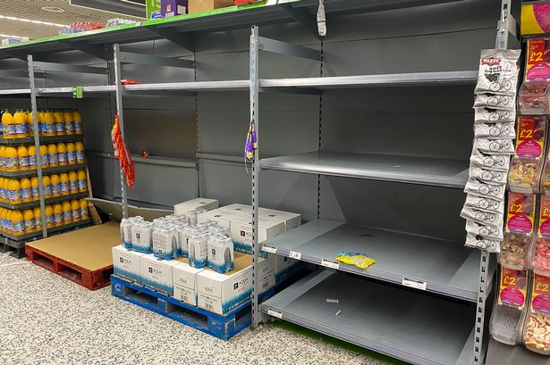
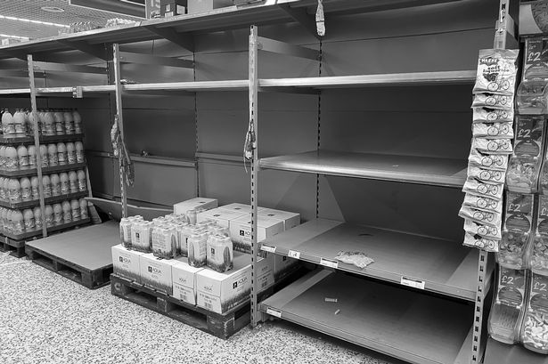
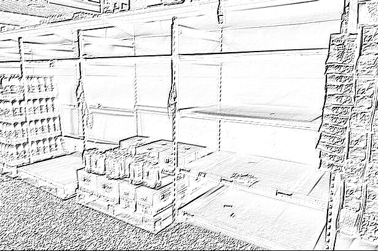
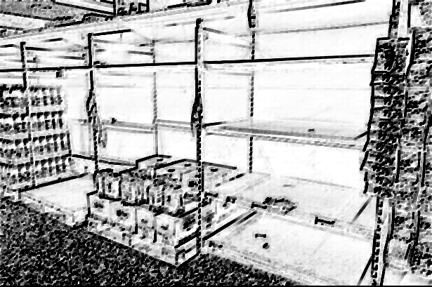
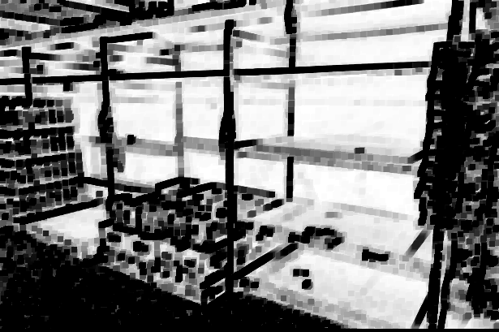

[start title]

Some title title title title title     title title title title title   title title title title title title title title title title title        title opsie

[end title]

[start tags]

Tag1, Tag2, ReallyLongTagReallyLongTag1234567890

[end tags]

[start lead]

Some xy lead lead lead lead lead lead lead lead lead lead lead lead lead lead lead lead lead lead
lead lead lead lead lead lead lead lead lead lead    lead lead lead lead lead lead lead lead lead
lead lead lead lead  lead lead lead lead lead lead lead lead lead   lead lead lead lead lead lead
lead lead lead lead lead   lead lead lead lead lead lead lead lead  lead lead lead lead lead lead
lead lead lead lead lead lead lead lead lead  lead  lead  lead lead lead lead lead lead lead lead
lead lead lead lead lead           lead lead opsie

[end lead]

[start content]

#   Section 1
 Blablablabla, I need to display some images     
Dupa  [link 1](https://www.google.com/) dummy [link 2](facebook.com)   
   

## Section 1.1
some text  

## Section 1.2
some text *italic 1*  

## Section 1.3
some text **bold 1**  
1. item a
2. item b *italic 2*
3. item c 
4. item d

# Section 2

    
## Section 2.1
some text:
- item 1
  - item 1.1
  - item 1.2
    - item 1.2.1
    - item 1.2.2
      - item 1.2.2.1
      - item 1.2.2.2
    - item 1.2.3
  - item 1.3
  - item 1.4 **bold 2**
- item 2
- item 3
  - item 3.1
    - item 3.1.1
    - item 3.1.2
  - item 3.2
- item 4
  

  
## Section 2.2
some text [link 3](https://www.youtube.com/watch?v=dQw4w9WgXcQ&ab_channel=RickAstley)
- item 1
- item 2
  - item 2.1
    - item 2.1.1
    - item 2.1.2
  - item 2.2
- item 3
  
[end content]